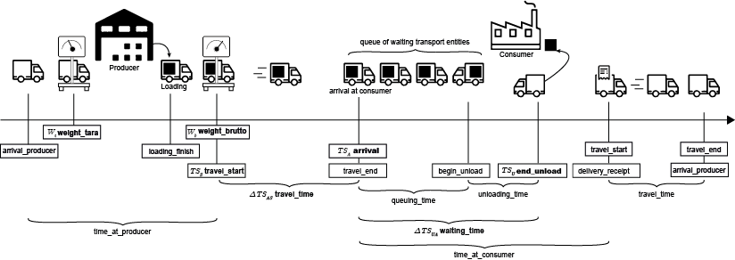

# Real Transportation Data Benchmark

## Context

In order to introduce a benchmark on waiting time prediction, we have been working together with a company which provided us with an original data source of over 150 GB of GPS points and planning data. 
The data originates from a tool, that is used to plan and monitor production measures and contains timestamps and locations. We have condensed these data into a final dataset of 6144 deliveries from a total of 165 transporters in a period over 1 year. This condensed dataset is provided in this repository.

An overview of the process how the data were gathered can be found in the paper **soon to be released**.

## Content

Every row of the dataset displays one delivery cycle. For a better understanding the following graphic will help identifying the features in the delivery cycle:

| Feature                | Format  | Reference in paper | Description                                                                                                                                                                                                                    |
| ---------------------- | ------- | ------------------ | ------------------------------------------------------------------------------------------------------------------------------------------------------------------------------------------------------------------------------ |
| pm_id                  | Enum    | $id_p$             | An ID that determines the exact production measure                                                                                                                                                                             |
| pm_cumulative_material | Integer | $pm_M$             | Describes the total cumulative material needed for the production measure                                                                                                                                                      |
| pm_transporters_used   | Integer | $pm_N$             | Determines how many different transporters where used                                                                                                                                                                          |
| pm_total_deliveries    | Integer | $pm_F              | How often material was unloaded at the consumer                                                                                                                                                                                |
| pm_travel_time         | Integer | $pm_{\bar{T}}$     | The average traveltime from the producer to the consumer in seconds                                                                                                                                                            |
| pm_frequency           | Integer | $pm_I$             | The average frequency when transporters were supposed to depart from the producer in seconds.                                                                                                                                  |
| pm_start               | Epoch*  | $pm_S$             | The start time of the production measure. For the publicly available set, this value was set to 0. *Should you require access to the private dataset with exact temporal information, please contact klinger2709(at)gmail.com* |
| pm_end_delta           | Integer | $pm_E$             | An offset to pm_start that determines when the production measure has ended in seconds.                                                                                                                                        |
| transporter_id         | Enum    | $id_t$             | An ID that universally identifies the transporter across multiple production measures.                                                                                                                                         |
| transporter_type       | Enum    | $id_{tt}$            | An ID that universally identifies the type and model of the transporter across multiple production measures                                                                                                                    |
| material_id            | Enum    | $id_m$             | A nominal value which universally identifies the material across multiple production measures.                                                                                                                                 |
| transporter_weight     | Integer | $id_t$             | Determines the weight of the transporter in metric tons                                                                                                                                                                        |
| material_weight        | Integer | $id_m$             | Determines the amount of material that is loaded on the transporter in metric tons                                                                                                                                             |
| travel_start_delta     | Integer | $ts_S$             | An offset to pm_start that determines when the transporter departed from the production entity in seconds.                                                                                                                     |
| arrival_delta          | Integer | $\Delta{}TS_{SA}$  | An offset in epoch format that determines when the transporter arrived at the consumer entity in seconds.                                                                                                                      |
| end_unload_delta       | Integer | $\Delta{}TS_{UA}$  | The offset to pm_start which determines when the transporter has finished unloading in seconds.                                                                                                                                |